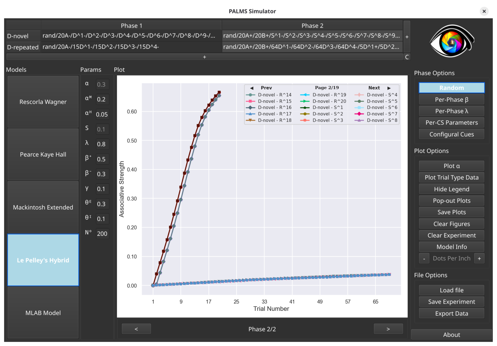
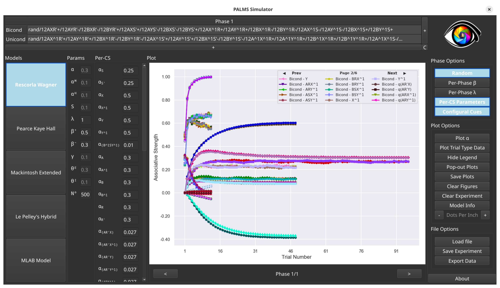
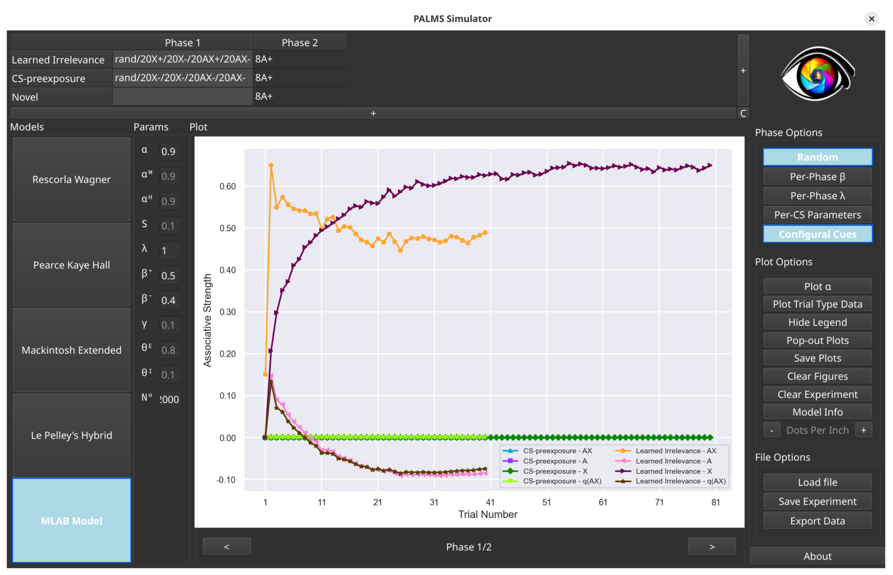

# PALMS: **P**avlovian **A**ssociative **L**earning **M**odels **S**imulator

Associative learning simulator, originally cased on the **extra task** of
INM703 Computational Cognitive Systems.

This simulator will be presented in the paper ``PALMS: Pavlovian Associative
Learning Models Simulator`` by Martin Fixman, Alessandro Abati,
Julián Jiménez Nimmo, Sean Lim, and Esther Mondragón.

## Runnable executable bundled with the prerequisites.

The executable version of the simulator can be found [in the latest release](https://github.com/cal-r/PALMS-Simulator/releases/latest).
* [Linux version](https://github.com/cal-r/PALMS-Simulator/releases/latest/download/PALMS_linux.tar.gz)
* [MacOS version](https://github.com/cal-r/PALMS-Simulator/releases/latest/download/PALMS_macos.tar.gz)
* [Windows version](https://github.com/cal-r/PALMS-Simulator/releases/latest/download/PALMS_windows.tar.gz)

Each version of PALMS has releases bundled with Python and its respective
libraries to create executables for Linux, MacOS, and Windows. These bundles
work on systems that don't have Python or its respective libraries installed.

## Simulating Experiments

The simulator can simulate a wide variety of experiments with a large amount of
stimuli and various different configurations.



Various experiments are provided within the releases and in this repo, proving
the wide variety of experiments that can be run.



The simulator comes with four existing models of cognitive learning, and also
comes bundled with our own formulation, the MLAB Model.



More information about the models and the simulator itself is present in the
paper.

## Licence and Notice

This project is licensed under the GNU Lesser General Public License (LGPL),
version 3.

Citation Requirement: Any publication using this project must contain the
following citation in the text.

```
@article{
    title = {{PALMS: Pavlovian Associative Learning Models Simulator}},
    author = {
        Fixman, Martin and
        Abati, Alessandro and
        Jimenez, Julian Nimmo and
        Lim, Sean and
        Mondragon, Esther
    },
    journal = {Computer Methods and Programs in Biomedicine},
}
```

Authors must be notified of any modifications and releases of this system.

Any modifications or uses of the simulator, the adaptive type formulas, or any
other code in this repository must be released and licensed under the LGPL. It
might however be bundled with non LGPL'd code.

## Running the Python code

### Requirements

- Python ≥ 3.10
- Seaborn
- PyQt6
- colorcet

Once Python is installed, the requirements can be installed with the following
command.

```
python -m venv venv
source venv/bin/activate
pip install -r requirements.txt
python PALMS.py
```
